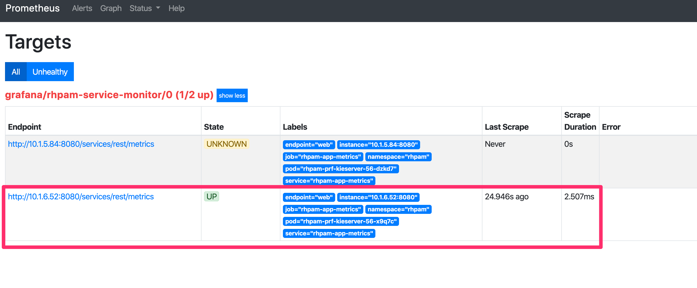

# Openshift 3.11 Prometheus + Grafana Router Monitoring

Red Hat Processo Automation (RHPAM) Monitoring using Prometheus and Grafana in Openshift

All examples below, use `rhpam` for kie-server namespace and `grafana` for prometheus namespace. Change this according to your environment.

## Pre-req

First, we need to expose prometheus metrics on kie-server. For that, run:

```bash
oc set env dc/rhpam-prf-kieserver PROMETHEUS_SERVER_EXT_DISABLED=false -n rhpam
```

> Remember to replace `rhpam-prf-kieserver` according to your environment

## Service Configuration

Now, we need to create another service in the same namespace of kie-server.

Create the following file:

```yaml
apiVersion: v1
kind: Service
metadata:
  annotations:
    description: RHPAM Prometheus metrics exposed
  labels:
    app: rhpam-prf-kieserver
    application: rhpam-prf-kieserver
    template: rhpam-prf-kieserver
    metrics: rhpam
  name: rhpam-app-metrics
spec:
  ports:
    - name: web
      port: 8080
      protocol: TCP
      targetPort: 8080
  selector:
    deploymentConfig: rhpam-prf-kieserver
  sessionAffinity: None
  type: ClusterIP
```

oc apply -f svc-metrics-kie-server.yaml -n rhpam

## Testing PAM metrics

To test if our metrics is working, just execute:

```bash
oc -n rhpam exec rhpam-prf-kieserver-56-x9q7c -- curl --silent -u youruser:yourpass localhost:8080/services/rest/metrics
```

> Remember to replace `rhpam-prf-kieserver-56-x9q7c` for your pam pods name and change youruser:yourpass to your kie-server username and password

You should see something similar to this:

```text
# HELP kie_server_job_duration_seconds Kie Server Job Duration
# TYPE kie_server_job_duration_seconds summary
# HELP kie_server_process_instance_started_total Kie Server Started Process Instances
# TYPE kie_server_process_instance_started_total counter
# HELP kie_server_start_time Kie Server Start Time
# TYPE kie_server_start_time gauge
kie_server_start_time{name="rhpam-prf-kieserver",server_id="rhpam-prf-kieserver",location="https://rhpam-prf-kieserver-rhpam.apps.bsb-8594.open.redhat.com:443/services/rest/server",version="7.30.0.Final-redhat-00003",} 1.584546470146E12
# HELP kie_server_data_set_lookups_total Kie Server Data Set Running Lookups
# TYPE kie_server_data_set_lookups_total gauge
# HELP kie_server_process_instance_completed_total Kie Server Completed Process Instances
# TYPE kie_server_process_instance_completed_total counter
# HELP kie_server_deployments_active_total Kie Server Active Deployments
# TYPE kie_server_deployments_active_total gauge
kie_server_deployments_active_total{deployment_id="enviar-na_1.0.0-SNAPSHOT",} 1.0
kie_server_deployments_active_total{deployment_id="order-management_1.1-SNAPSHOT",} 1.0
# HELP kie_server_job_scheduled_total Kie Server Started Jobs
# TYPE kie_server_job_scheduled_total counter
# HELP kie_server_process_instance_sla_violated_total Kie Server Process Instances SLA Violated
# TYPE kie_server_process_instance_sla_violated_total counter
# HELP kie_server_data_set_execution_total Kie Server Data Set Execution
# TYPE kie_server_data_set_execution_total counter
# HELP kie_server_data_set_execution_time_seconds Kie Server Data Set Execution Time
# TYPE kie_server_data_set_execution_time_seconds summary
# HELP kie_server_process_instance_duration_seconds Kie Server Process Instances Duration
# TYPE kie_server_process_instance_duration_seconds summary
# HELP kie_server_job_running_total Kie Server Running Jobs
# TYPE kie_server_job_running_total gauge
# HELP kie_server_work_item_duration_seconds Kie Server Work Items Duration
# TYPE kie_server_work_item_duration_seconds summary
# HELP kie_server_container_started_total Kie Server Started Containers
# TYPE kie_server_container_started_total counter
kie_server_container_started_total{container_id="enviar-na_1.0.0-SNAPSHOT",} 1.0
kie_server_container_started_total{container_id="order-management_1.1-SNAPSHOT",} 1.0
# HELP kie_server_job_executed_total Kie Server Executed Jobs
# TYPE kie_server_job_executed_total counter
# HELP kie_server_container_running_total Kie Server Running Containers
# TYPE kie_server_container_running_total gauge
kie_server_container_running_total{container_id="enviar-na_1.0.0-SNAPSHOT",} 1.0
kie_server_container_running_total{container_id="order-management_1.1-SNAPSHOT",} 1.0
# HELP kie_server_data_set_registered_total Kie Server Data Set Registered
# TYPE kie_server_data_set_registered_total gauge
kie_server_data_set_registered_total{name="jbpmProcessInstanceLogs::CUSTOM",uuid="jbpmProcessInstanceLogs",} 1.0
kie_server_data_set_registered_total{name="jbpmRequestList::CUSTOM",uuid="jbpmRequestList",} 1.0
kie_server_data_set_registered_total{name="tasksMonitoring::CUSTOM",uuid="tasksMonitoring",} 1.0
kie_server_data_set_registered_total{name="getAllTasks::TASK",uuid="getAllTasks",} 1.0
kie_server_data_set_registered_total{name="jbpmExecutionErrorList::CUSTOM",uuid="jbpmExecutionErrorList",} 1.0
kie_server_data_set_registered_total{name="processesMonitoring::CUSTOM",uuid="processesMonitoring",} 1.0
kie_server_data_set_registered_total{name="jbpmHumanTasksWithAdmin::FILTERED_BA_TASK",uuid="jbpmHumanTasksWithAdmin",} 1.0
kie_server_data_set_registered_total{name="jbpmHumanTasks::CUSTOM",uuid="jbpmHumanTasks",} 1.0
kie_server_data_set_registered_total{name="jbpmHumanTasksWithUser::FILTERED_PO_TASK",uuid="jbpmHumanTasksWithUser",} 1.0
kie_server_data_set_registered_total{name="jbpmHumanTasksWithVariables::CUSTOM",uuid="jbpmHumanTasksWithVariables",} 1.0
kie_server_data_set_registered_total{name="jbpmProcessInstancesWithVariables::CUSTOM",uuid="jbpmProcessInstancesWithVariables",} 1.0
kie_server_data_set_registered_total{name="jbpmProcessInstances::CUSTOM",uuid="jbpmProcessInstances",} 1.0
# HELP kie_server_process_instance_running_total Kie Server Running Process Instances
# TYPE kie_server_process_instance_running_total gauge
kie_server_process_instance_running_total{container_id="enviar-na_1.0.0-SNAPSHOT",process_id="enviar_na_teste",} 1088648.0
# HELP kie_server_execution_error_total Kie Server Execution Errors
# TYPE kie_server_execution_error_total counter
# HELP kie_server_job_cancelled_total Kie Server Cancelled Jobs
# TYPE kie_server_job_cancelled_total counter
```

### Prometheus

We need to install prometheus on your Openshift cluster.

```bash
# Replace every file with your project
sed -i -e 's/namespace: .*/namespace: your-project/' prometheus-operator/*.yaml
sed -i -e 's/myproject/your-project/g' install-prometheus.sh

# Install prometheus
./install-prometheus.sh
```

In case for any problem on your prometheus regarding permission, you can:

```bash
oc adm policy add-cluster-role-to-user cluster-admin -z prometheus-operator -n <your-project>
```

You can also follow the oficial docs: https://github.com/coreos/prometheus-operator

### Grafana

To install grafana, run:

```bash
# Replace every file with your project
sed -i -e 's/myproject/your-project/g' install-grafana.sh

./install-grafana.sh
```

### Service Monitor

Create a secret in namespace grafana containing your user and pass for pam endpoint metrics:

```yaml
apiVersion: v1
data:
  password: YWRtaW4= # yourpass in base64
  username: cmVkaGF0 # youruser in base64
kind: Secret
metadata:
  name: basic-auth
type: Opaque
```

```bash
oc create -f secret.yaml -n grafana
```

An easy way to transform your user and pass to base64 is using the following command:

```bash
echo -n "admin" | base64
echo -n "pass" | base64
```

Now, let's create the service monitor:

```yaml
apiVersion: monitoring.coreos.com/v1
kind: ServiceMonitor
metadata:
  labels:
    team: frontend
  name: rhpam-service-monitor
spec:
  endpoints:
  - basicAuth:
      password:
        key: password
        name: basic-auth
      username:
        key: username
        name: basic-auth
    path: /services/rest/metrics
    port: web
  namespaceSelector:
    matchNames:
    - rhpam
  selector:
    matchLabels:
      metrics: rhpam
```

```bash
oc apply -f service-monitor.yaml -n grafana
```

### Prometheus Targets

Check if your kie-server is showing on Prometheus targets page



### Grafana Dashboard

You can install the dashboards below:

* 

### Docs

* https://access.redhat.com/documentation/en-us/red_hat_process_automation_manager/7.6/html/managing_and_monitoring_process_server/prometheus-monitoring-con_execution-server#prometheus-monitoring-ocp-proc_execution-server
